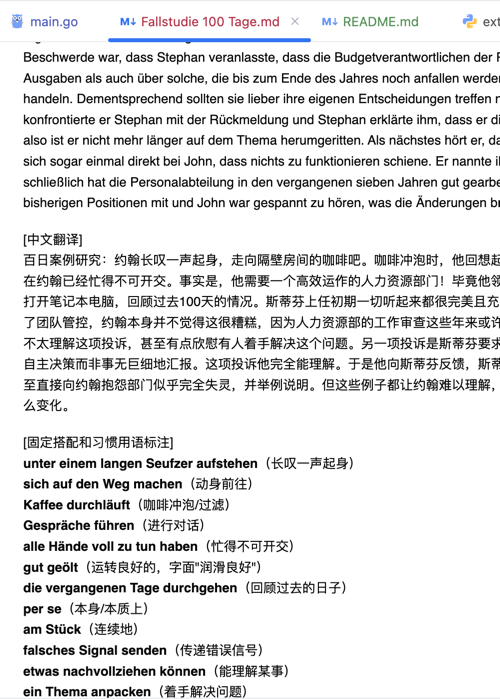
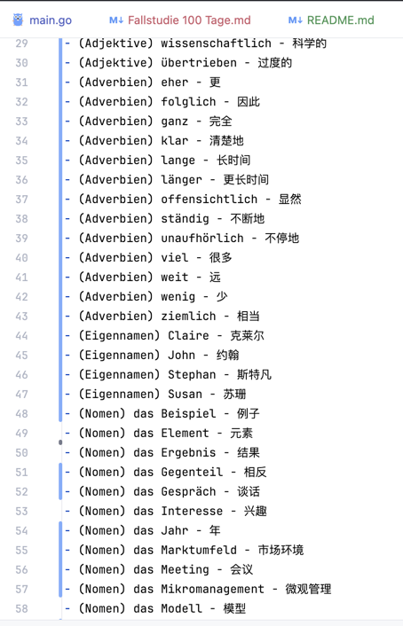
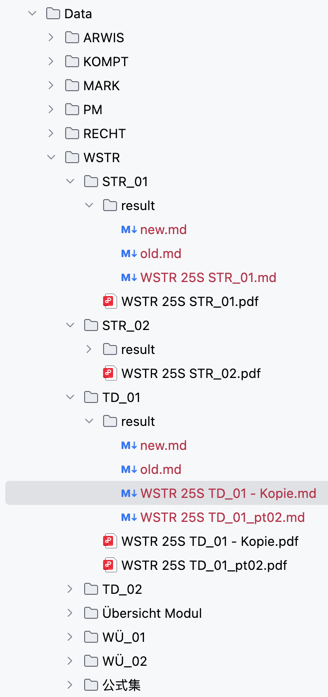
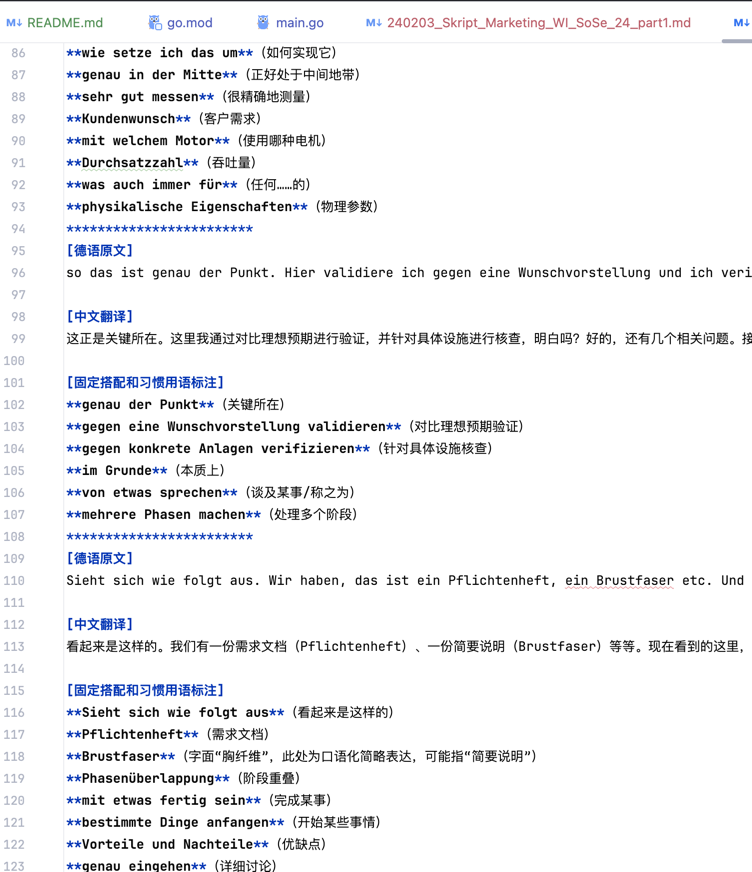

了解了！我会为你的德语文件批量处理项目撰写一份中文分析报告，内容包括：
1. 项目整体结构概览总结
2. 每个主要结构（如 Project、Folder、Part、File、Cache 等）的功能与关系
3. 每个函数的详细解析，包括其用途、流程与注意事项

我会用清晰的段落、标题，并保证表达简洁准确。马上开始整理，稍后发给你！

# 项目概述

该项目旨在**批量处理德语文本文件并生成笔记和词汇表**。整体流程如下：在指定的项目目录下，每个一级子文件夹对应一个“Folder”，每个Folder下包含若干“Part”子文件夹，每个Part中包含多个文本或PDF文件。程序遍历每个文件，先调用DeepSeek API按要求**重排文本格式**（`promptForOrganize`），然后并行地生成中文注释笔记（`promptForNotizen`）和提取词汇清单（`promptForClassify`）。对于每个文件处理结果，生成对应的Markdown笔记，并返回该文件的词汇集合。Folder级别将各Part的词汇集合依次合并，对比前后Part的词汇增量，分别对“新增词汇”和“已有词汇”集合调用DeepSeek的格式化提示（`promptForFormat`），最终在每个Part的`result`子目录中生成`new.md`和`old.md`文件。项目的核心模块（Project、Folder、Part、File、Cache等）协同工作，形成从目录遍历到API调用再到结果保存的完整工作流。

## 结构分析

- **Project 结构体**：包含`projectName`和`targetDir`字段。`targetDir`指定顶层项目目录的路径（默认为工作目录下的“Project”文件夹）。`Project.Run()`方法启动整个流程，负责检查或创建项目目录，收集所有一级子文件夹路径，并对每个子文件夹执行`Folder.Run`。

- **Folder 结构体**：只有`absolutePath`字段，表示一个项目子文件夹的绝对路径。`Folder.Run()`方法先读取该目录下所有子目录（即Part），按名称排序后依次处理。它调用`Part.Run()`收集每个Part的词汇集合，并依次计算与之前集合的差异（差集表示新增词，交集表示已有词）。然后分别对新增集合和已有集合调用`askDeepSeekFormat`（并发处理），最后为每个Part保存格式化结果。

- **Part 结构体**：只有`absolutePath`字段，表示一个Part目录路径。`Part.Run()`方法遍历该目录下的所有文件（忽略子文件夹），对每个文件调用`File.Run()`并发处理，获取每个文件的词汇集合。`Part.Run()`将所有文件返回的词汇集合合并（取并集），作为该Part的总词汇集合返回给Folder。

- **File 结构体**：只有`absolutePath`字段，表示一个文件（文本或PDF）的绝对路径。`File.Run()`是对单个文件的处理入口：先调用`readFileToLines()`读取文本，`processLinesOrganize()`对文本段落进行格式整理，随后并行调用`processLinesToNotizen()`生成笔记和`processLinesToClassifyHash()`生成词汇集合。处理完成后，`File.Run()`将笔记结果写入文件所在目录下的`result/<文件名>.md`，并将词汇集合返回给Part。

- **Cache 结构体**：用于请求结果缓存，包含一个读写锁`RWMutex`、字符串映射`data`、文件路径`path`和计数器`count`。程序启动时通过`initCache()`创建单例`GlobalCache`并从`requests_cache.json`加载已有缓存。每次成功调用DeepSeek API后，结果会通过`GlobalCache.Set()`写入内存，并周期性地通过`SavePer()`写入磁盘，以减少重复网络请求。

- **RequestData 结构体**：用于构造DeepSeek API的请求体。包含模型名称`Model`（固定为“deepseek-chat”）和消息列表`Messages`，其中只有一条`{Role: "user", Content: prompt+text}`。

- **ResponseData 结构体**：用于解析DeepSeek API的JSON响应。只关心其中`Choices[0].Message.Content`字段，即API返回的文本结果。

## 函数解析

### Project.Run

`Project.Run()`是整个程序的入口之一。其主要流程为：检查并创建顶层项目目录`targetDir`；读取该目录下所有项，筛选出子目录并获取其绝对路径；调用`ProcessArray`并发地对每个子目录执行`NewFolder(path).Run()`；所有Folder处理完成后，将全局缓存通过`GlobalCache.Save()`写入文件。整个过程中，如果项目目录不存在则创建，若子目录读取失败则输出错误并终止。

### Folder.Run

`Folder.Run()`处理一个一级子目录（Folder）。它先读取并按名称排序该目录下的所有项，筛选出子文件夹（视为Parts）。然后使用`ProcessArray`并发执行每个Part的`Run()`方法，获得一个词汇集合列表`setFromPart`。接着，顺序遍历这些词汇集合：对每个集合计算与之前已出现词汇集合`existedSet`的差集和交集，分别得到该Part的新增词汇`diffNewSet`和已有词汇`diffOldSet`，并更新`existedSet`为并集。之后，`Folder.Run()`并发调用两个goroutine：一个使用`askDeepSeekFormat`处理所有`diffNewSetList`，另一个处理`diffOldSetList`，结果分别存入`NewMdTextList`和`OldMdTextList`。待格式化完成后，循环为每个Part依次将对应的`NewMdTextList[i]`和`OldMdTextList[i]`内容保存到该Part目录的`result`子文件夹下，文件名为`new.md`和`old.md`。最后调用`GlobalCache.Save()`持久化缓存。

### Part.Run

`Part.Run()`处理一个具体的Part目录。它读取该目录下的所有文件（忽略子目录），将文件绝对路径收集到`fileList`。使用`ProcessArray`并发对每个文件执行`NewFile(path).Run()`，获取返回的词汇集合列表`wordSetList`。然后将这些集合并入一个总词汇集合`mergedSet`（对每个集合取并集），最后返回此`mergedSet`给调用者（Folder）。

### File.Run

`File.Run()`处理单个文件。其流程如下：首先调用`readFileToLines()`读取文件内容，生成若干字符串块，每块包含最多10行文本或一个PDF页的文本。随后，先后对这些文本块进行两项并行处理：

- **文本整理**：调用`f.processLinesOrganize(lines)`，对每个文本块使用`askDeepSeek(promptForOrganize, text)`重排文本格式，返回新的文本块列表。
- **笔记与词汇提取并行**：启动两个goroutine：一个执行`f.processLinesToNotizen(lines)`，即对每个文本块调用`askDeepSeek(promptForNotizen, text)`生成带有德文原文、中文翻译和习语标注的笔记段落，并用分隔符拼接成一个字符串；另一个执行`f.processLinesToClassifyHash(lines)`，即对每个文本块调用`askDeepSeek(promptForClassify, text)`提取词汇，每个块返回多行单词列表，再合并这些列表中所有单词为一个`map[string]bool`集合（去重）。两者完成后，用WaitGroup等待。

处理结束后，`File.Run()`取当前文件名（不含扩展名）构造结果文件名，将笔记结果写入同级目录下的`result/<文件名>.md`。函数最终返回该文件的词汇集合（`map[string]bool`）给上层调用。

### ProcessArray

`ProcessArray`是一个通用并发处理函数模板。它接受任意类型的切片`input []T`和对应的处理函数`processFunc func(T) R`，并行地对每个元素进行处理。内部使用`sync.WaitGroup`等待所有任务完成。对每个元素执行前，会调用全局的速率限制器`limiter.Wait()`，以控制并发请求速率。处理结果按原序存入输出切片并返回。该函数被用于并行处理文件列表、文本块列表和词汇集合列表，提高程序吞吐量。

### askDeepSeek 和 askDeepSeekFormat

`askDeepSeek(prompt, text)`负责向DeepSeek API发送请求并返回响应结果：首先将`prompt`与`text`拼接成请求内容，并在全局缓存`GlobalCache`中查找。如果命中缓存，直接返回缓存值；否则按速率限制器要求等待后发送新的POST请求到`https://api.deepseek.com/v1/chat/completions`，请求体使用`RequestData`结构。收到响应后解析为`ResponseData`结构并提取`Choices[0].Message.Content`。结果被存入缓存，并调用`SavePer()`定期将缓存写回文件。若遇到429（速率限制）错误，将根据响应头等待指定时间后自动重试。

`askDeepSeekFormat(set map[string]bool)`用于处理一组词汇列表输出格式。它将词汇集合排序后分段，每段最多250个词，通过`ProcessArray`并行调用`askDeepSeek(promptForFormat, text)`获得每段的Markdown格式文本，然后将所有段落拆分回单词行并重新排序拼接成最终字符串返回。该函数在Folder级别被用于生成`new`和`old`词汇文件的内容。

### 其他辅助函数

- `File.readFileToLines()`：根据文件扩展名决定处理方式。对PDF文件调用`extractTextFromPDF`（执行外部Python脚本提取页级文本列表）；对其他文本文件使用`bufio.Scanner`逐行读取，每10行合并为一个块，生成字符串切片返回。

- `extractTextFromPDF()`：通过`exec.Command`调用同目录下的`extract_words_from_pdf.py`脚本，将PDF路径传入，读取其JSON输出（假设为[]string），并返回该字符串切片。

- **集合操作函数**：`intersection`, `union`, `difference`分别计算两个`map[string]bool`集合的交集、并集和差集。Folder.Run 中用差集计算当前Part的新词，用交集计算已有词，用并集更新累积集合。

- **保存结果**：`saveResultToFile(resultString, name)`方法在`Part`和`File`中均定义。它确保对应的`result`目录存在，然后将传入内容写入名为`name+".md"`的文件。`File.saveResultToFile`将笔记按文件名保存，`Part.saveResultToFile`将词汇列表保存为`new.md`或`old.md`。

## 优点与改进点

**优点：**该项目设计了完善的**并发处理机制**，在遍历文件和调用深度学习接口时广泛使用goroutine和`sync.WaitGroup`，结合`ProcessArray`函数并发处理列表任务，大大提高了处理效率。同时使用全局**缓存机制** (`Cache`)记录已请求过的文本内容及结果，避免重复请求DeepSeek API；缓存以JSON文件持久化，减轻网络开销。代码还集成了**速率限制器** (`rate.Limiter`)，在并发请求前通过`limiter.Wait()`确保API调用不超过预设频率（配合Burst控制）以防触发限流。总体来看，程序逻辑清晰，模块分工明确，适合单后端、个人使用的批量文本处理需求。

**可优化或注意的地方：**虽然并发提升了性能，但也需要注意顺序与资源管理。例如`ProcessArray`在启动每个任务前即`limiter.Wait()`，可能导致任务启动间隔拉长，具体可根据实际QPS需求调整。此外，缓存写回策略在每15次写入后触发，可能在程序异常退出时丢失最后的写入，建议优化持久化频率或增加程序退出时的最后保存。错误处理上目前多使用`log.Fatalf`直接终止，后续可考虑更细致的错误恢复策略。在输入文本分块方面（每10行作为一块）对长句可能造成分割断句的问题，可根据实际文本类型调整块大小。最后，项目中API密钥硬编码在代码中，现实使用时应注意安全管理。总体而言，该项目结构合理，应对小规模批量处理已较为完善。
## 小结

整体来看，您的项目通过 Go 强大的并发能力与结构化设计，实现了对大规模文件的高效批量 NLP 处理，并配合缓存与限流机制，兼顾了性能与成本。但在可配置性、错误处理、可测试性及安全性方面还可优化。希望上述分析与建议能够帮助您进一步完善项目架构与质量。

有什么问题或建议，欢迎随时交流！

联系邮箱：`< Dominik_For_Heybox@163.com >`

文档组结构实例：

单词汇总md文件生成实例:

课件笔记生成实例:

课堂老师口语数据笔记生成实例：

## 项目初衷，历程
- 这个项目的起因是，2个月的德国留学造成的需求
- 历程可以归类成三种因素：
- 需求，限制，结果

1 . 刚开始：
- 需求：想知道老师嘴巴里说的我们没学过的词，
- 限制:小米15的同声传译免费而且准确度无敌高
- 结果：我们采用了小米15的同声传译，来获得字幕

2 . 之后：
- 需求：想在课后能找到那些生词
- 限制：手动抄录整理生词，或是去翻字幕文件也太傻了
- 结果：我们开发了第一版项目，使用python脚本和自然语言库。提取归类出每个科目每节课的新词

3 . 最近：
- 需求：单词背的差不多了，但是课件里的固定搭配看不太懂，一个一个查好麻烦。以及想学习课堂老师的口语表达
- 限制：提取固定搭配和理解语义，目前只有AI能做到。DeepSeek V3价格便宜。而且网络请求需要并发。
- 结果：我们开发了第二版项目，使用Go语言和DeepSeek V3 API。提取归类出每个科目每节课的固定搭配和老师的口语表达
