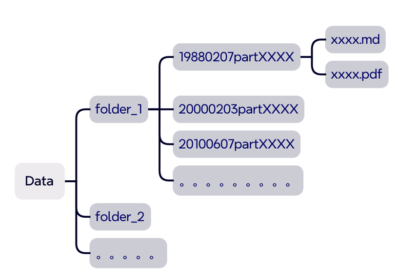
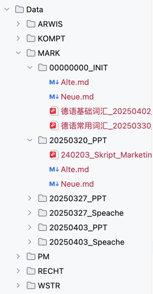
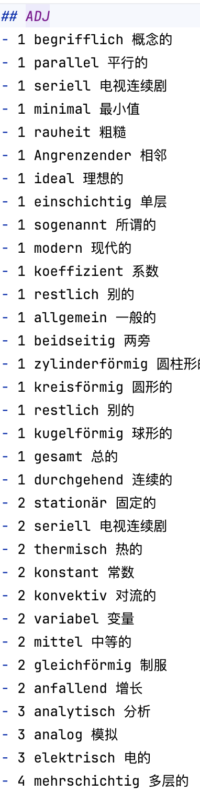
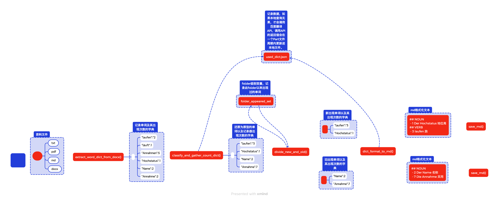

# 使用步骤
## 制作初衷 ✨
- 原因在德语课堂上会遇到新的没有见过的单词，但是课堂上很难有时间去记录和查阅。(就算用同声传译也很难标记下来，谁会课后去看字幕呢？)
- 于是我们尝试，课堂上用小米手机同声传译纯看德语字幕。课后导出字幕文件，结合课堂上使用的资料文件，自动化地提取出课堂新出现的单词。以供复习。
## 1.下载项目
- 行命令下载项目
```
git clone https://github.com/Dominik2077w/Germen_words_Compilation.git
```
- 或者直接下载zip包,解压缩到本地.: 点击< > Code按钮，选择Download ZIP
## 2.安装依赖
- 使用pip安装依赖库
```
pip install -r requirements.txt
```
## 3.解释器使用Python 3.12, Python 3.13有兼容问题
## 4.填写百度翻译API密钥
- 在Methode.py中，填入你的百度翻译的API密钥和ID。如果没有的话，可以去百度翻译申请一个免费的API密钥和ID
## 5.构建文件夹结构
- 使用者应该按照如图结构在python项目目录下构建自己的三层文件夹结构，并将资料文件放入对应文件
- 
- 结构实例
- 
## 6.启动程序-启动方式
- 1 . 通过Project类的__init__方法，传入一个本项目的通向Project层目录的相对路径(比如说Data)，创建一个Project对象，对全局重新计算以及覆盖保存
```
from Object import Project

if __name__ == "__main__":
    Project('Data').__run__()
```
- 2 . 通过Folder类的__init__方法，传入一个本项目的通向Folder层目录相对路径(比如说Data/MARK)，创建一个Folder对象，并传入一个字符串参数(比如说20231001)，对这个文件夹下的所有在输入字符串参数日期之后的Part目录进行重新计算和覆盖保存。
```
from Object import Folder

if __name__ == '__main__':
    Folder('Data/MARK').__run__("20231001")
```
## 7.结果
- 1 . 计算完成后，对应目录下会生成neue文件与alte文件
- 
- 计算得到的neue.md文件中，(记录了当前part文件夹中存在的，并且在更早的part文件夹中没有存在过的)词汇。并汇总成了序列。
- 计算得到的alte.md文件中，(记录了当前part文件夹中存在的，并且在更早的part文件夹中已经存在过的)词汇。并汇总成了序列。
# 细节(以下可不看)

## Part类中的数据处理流程图
- 
## 碎碎念
- 这些处理好的单词序列能用来做什么呢，这取决于你的想法。我一般结合Obsidian的词典插件或者德语助手来使用。 
- 单词的中文翻译仅供参考
- used_dict.json中已经保存了一些我们计算过的单词。
## 灵感池 💡
- Scheißtag

## 今日心情

🌱 轻松 | 🎨 创意 | ⏳ 等待灵感
