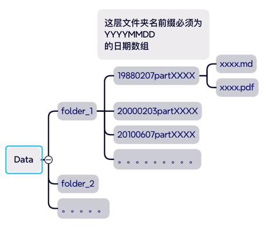
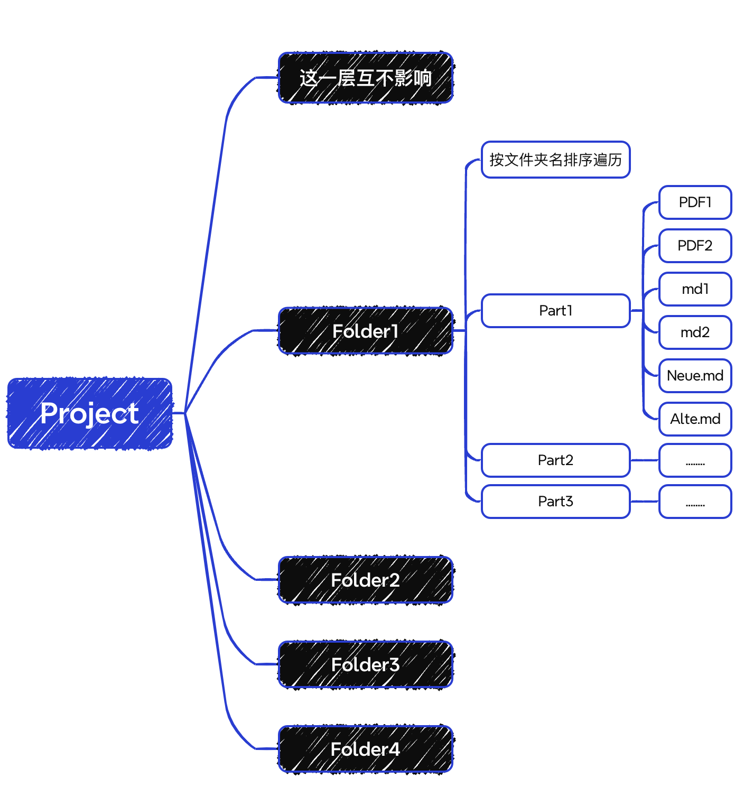
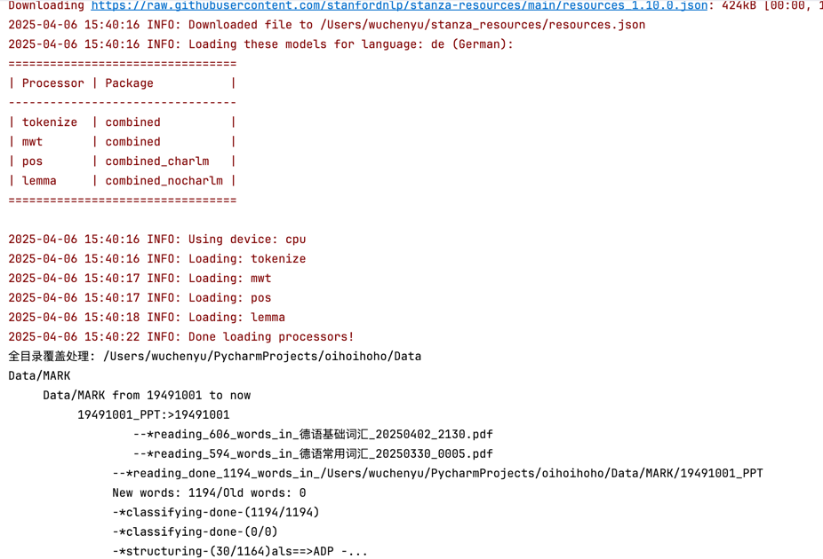
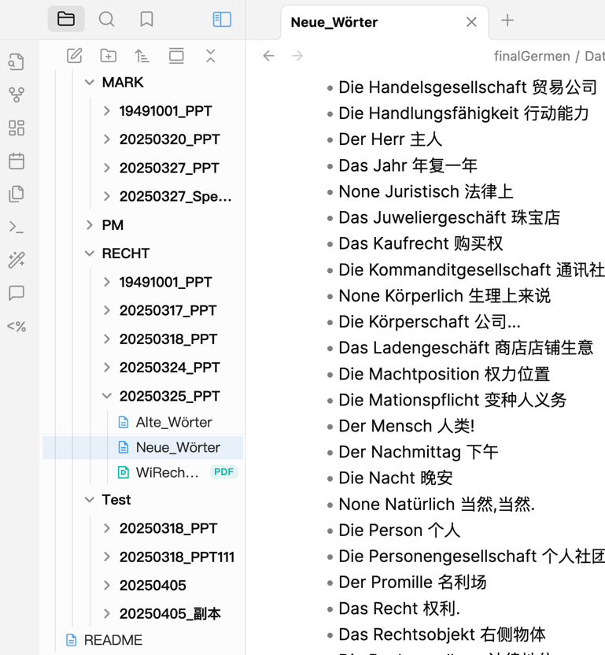
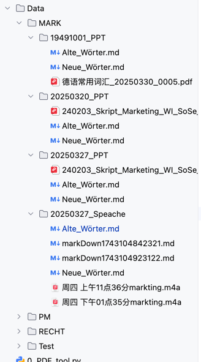

## 制作初衷 ✨
- 原因在德语课堂上会遇到新的没有见过的单词，但是课堂上很难有时间去记录和查阅。(就算用同声传译也很难标记下来，谁会课后去看字幕呢？)
- 于是我们尝试，课堂上用小米手机同声传译纯看德语字幕。课后导出字幕文件，结合课堂上使用的资料文件，自动化地提取出课堂新出现的单词。以供复习。
## 如何下载
```如何下载
- 网址:https://github.com/Dominik2077w/Germen_words_Compilation.git
- 或使用命令 git clone https://github.com/Dominik2077w/Germen_words_Compilation.git
```
## 依赖库
```
pip install -r requirements.txt #使用Python 3.12, Python 3.13有兼容问题
```


## 使用步骤
- 1 .使用者应该按照如图结构在Data目录下构建自己的文件夹结构，并将资料文件(md/非扫描版pdf)放入对应文件夹
- 2 .启动程序，等待完成计算。
- 
- 3 .计算完成后，对应目录下会生成neue_wörter文件与alte_wörter文件
- 4 .示例neue_wörter文件:
- 
## 主要启动函数
- 1 . sort_subdirs_by_date(relative_path, cutoff_date="19491001") :
- 输入一个相对路径 relative_path 和一个YYYYMMDD的时间戳 cutoff_date 。程序将在 relative_path 文件夹中的，时间戳在 cutoff_date 之后的文件夹开始重新计算并覆盖原来的neue_wörter.md与alte_wörter.md输出文件。cutoff_date 默认值为19491001
- 2 . list_data_subdirectories() : 
- 程序遍历Data文件夹，对所有子文件夹使用 sort_subdirs_by_date()函数。不给定cutoff_date参数，默认值为19491001。
## 逻辑细节
- folder级别的文件夹之间是相互独立的，互不影响
- 计算得到的neue_wörter.md文件中，(记录了当前part文件夹中存在的，并且在更早的part文件夹中没有存在过的)词汇。并汇总成了序列。
- 计算得到的alte_wörter.md文件中，(记录了当前part文件夹中存在的，并且在更早的part文件夹中已经存在过的)词汇。并汇总成了序列。
## 使用实例
- 1 . 建立了“课程结构——某节课”结构的的文件夹；第一个part文件夹导入了来自德语助手的基础词汇六百词，用来把简单词汇截流下来 :
- 
## 碎碎念
- 你问我为什么只接受非扫描版pdf文件和markdown文件？因为我们在课上用的是小米自带的同声传译，导出后的字幕文件是markdown。以及我们的Moodle课件都是非扫描版pdf。如果你有别的需求，可以自己增加几个读取文档的函数。如果你想读取扫描的PDF文件，建议使用ocr识别库进行处理。
- 录音文件和字幕文件，有时候是小米手机在课堂上同声传译的。有时候是单纯录音文件，放课后通过whisper加工的。0_Whisper_tool.py中记录了加工函数
- 当我打开WPS想分割PPT时，被要求会员。于是0_PDF_tool.py中记录了PDF分割函数
- 这些处理好的单词序列能用来做什么呢，这取决于你的想法。我一般结合Obsidian的词典插件或者德语助手来使用。 
- 单词的中文翻译仅供参考
## 灵感池 💡
- Schöntag
- Scheißtag

## 今日心情

🌱 轻松 | 🎨 创意 | ⏳ 等待灵感
